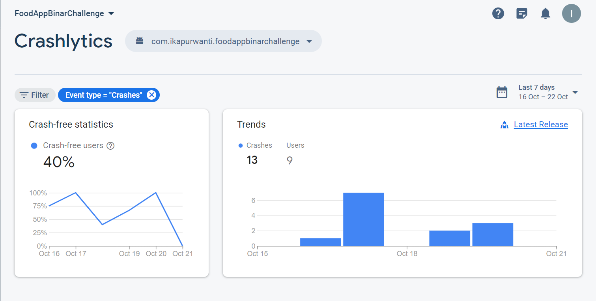

# Fodd App Binar

Food App for challenge Binar Academy

## Reference Design
Asset and design :
1. https://www.figma.com/file/aqSAY9HUHwhMZx06R8wgm6/food-app-(Community)?type=design&node-id=0-1&mode=design&t=mWwcHDan41UzlbwF-0 
2. https://www.figma.com/file/inCiY2Cmsv2JO3hRjCRYjE/Food-Couriers---Food-Delivery-App---UI%2FUX-Design-Case-Study-(Community)?type=design&node-id=0-1&mode=design&t=MhkXUg1Bqr1J1nGy-0

Asset logo :
- link image : https://global-uploads.webflow.com/62fdaf934899cf5b43a00e1a/630452503bf80f5e2097fe6b_minimal-logo-binar-academy.svg
- link address search : https://www.google.com/url?sa=i&url=https%3A%2F%2Fbusiness.binaracademy.com%2Fbinar-pro%2Fpricing&psig=AOvVaw3zS4d5imCfy6MOLUW3js2X&ust=1697997821343000&source=images&cd=vfe&opi=89978449&ved=0CBEQjRxqFwoTCNi0vPrch4IDFQAAAAAdAAAAABAI
- link posting : https://images.app.goo.gl/5pTTebVmLSZfZRjG8

## Attachments
- Screenshot Crashlytics
